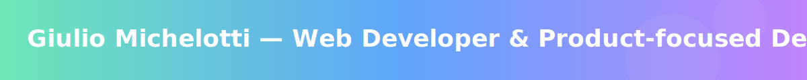
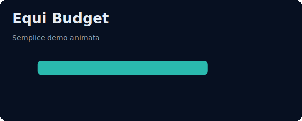
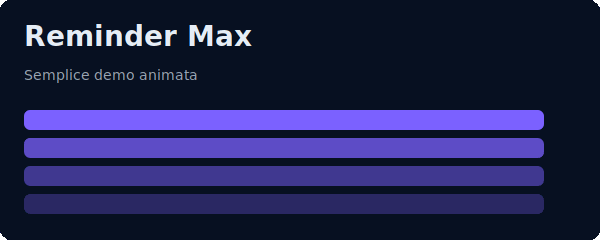

<div align="center">

<!-- ANIMATED HEADER -->


<!-- TYPING SVG -->
<a href="https://git.io/typing-svg"></a>

<!-- PROFILE VIEWS & SOCIAL BADGES -->
<p>

<a href="https://github.com/giuliomichelotti?tab=followers"></a>

</p>

</div>

---

## 🧠 La Mia Filosofia di Sviluppo

<table>
<tr>
<td width="50%">

### 🎯 Product-First Thinking

Non scrivo codice per il gusto di farlo. **Ogni riga di codice deve risolvere un problema reale**. Prima di toccare la tastiera, mi chiedo sempre:

- *Chi userà questo prodotto?*
- *Quale problema stiamo risolvendo?*
- *Qual è l'esperienza ideale per l'utente?*

Questo approccio mi ha portato a sviluppare **Equi Budget** e **Reminder Max** — due applicazioni nate da esigenze concrete, non da esercizi tecnici.

</td>
<td width="50%">

### ⚡ Full Stack con Passione

```javascript
const giulio = {
  frontend: ["React", "React Native", "TypeScript", "CSS Animations"],
  backend: ["Node.js", "Express", "WebSockets", "REST APIs"],
  database: ["SQLite", "Firebase", "localStorage"],
  philosophy: "Ship fast, iterate faster",
  superpower: "Turning complex problems into elegant UIs"
};
```

</td>
</tr>
</table>

### 🔮 I Tre Pilastri del Mio Codice

<div align="center">

| 🏗️ **Architettura Solida** | 🎨 **Design Intenzionale** | 🚀 **Performance Ossessiva** |
|:---:|:---:|:---:|
| Offline-first, sync quando possibile | Ogni pixel ha uno scopo | Ogni millisecondo conta |
| Modularità e riusabilità | Microinterazioni che guidano | Bundle size ottimizzato |
| Error handling elegante | Accessibilità by default | Lazy loading strategico |

</div>

---

## 🏆 Progetti Flagship

<div align="center">

</div>

---

### 💰 Equi Budget — *"La Finanza Personale, Semplificata"*

<table>
<tr>
<td width="45%">

</td>
<td width="55%">

#### 🎯 Il Problema
Gestire le spese condivise è un incubo: chi ha pagato cosa, chi deve a chi, quanto resta del budget. Fogli Excel confusi, note sul telefono, discussioni infinite.

#### ✨ La Soluzione
**Equi Budget** è un'app di budgeting che ho progettato e sviluppato con un obiettivo chiaro: **rendere la gestione finanziaria condivisa così semplice da essere piacevole**.

#### 🛠️ Stack Tecnologico
```
Frontend:    React Native + TypeScript
State:       Context API + useReducer  
Storage:     SQLite (offline-first)
Sync:        WebSockets (real-time)
Animations:  Reanimated 2 + Moti
```

#### 🌟 Features Chiave
- **Fair-Split Algorithm** — Distribuzione equa automatica
- **Category Breakdown** — Visualizzazione spending per categoria
- **Offline-First** — Funziona senza internet, sync quando disponibile
- **Real-time Sync** — Aggiornamenti istantanei tra dispositivi
- **Export/Import** — Backup JSON per portabilità totale

</td>
</tr>
</table>

<details>
<summary><b>📐 Architettura Tecnica di Equi Budget</b></summary>

```
┌─────────────────────────────────────────────────────────────┐
│                      PRESENTATION LAYER                      │
│  ┌─────────────┐  ┌─────────────┐  ┌─────────────────────┐  │
│  │  Dashboard  │  │ Transaction │  │   Category Charts   │  │
│  │   Screen    │  │   List      │  │   (Pie/Bar)         │  │
│  └─────────────┘  └─────────────┘  └─────────────────────┘  │
├─────────────────────────────────────────────────────────────┤
│                      BUSINESS LOGIC                          │
│  ┌─────────────┐  ┌─────────────┐  ┌─────────────────────┐  │
│  │ Fair-Split  │  │   Budget    │  │   Sync Manager      │  │
│  │  Calculator │  │   Engine    │  │   (WebSocket)       │  │
│  └─────────────┘  └─────────────┘  └─────────────────────┘  │
├─────────────────────────────────────────────────────────────┤
│                      DATA LAYER                              │
│  ┌─────────────────────┐  ┌─────────────────────────────┐   │
│  │   SQLite (Local)    │  │   Firebase (Cloud Backup)   │   │
│  └─────────────────────┘  └─────────────────────────────┘   │
└─────────────────────────────────────────────────────────────┘
```

</details>

---

### ⏰ Reminder Max — *"Mai Più un Promemoria Dimenticato"*

<table>
<tr>
<td width="55%">

#### �� Il Problema
Le app di reminder esistenti sono o troppo semplici (mancano le ricorrenze) o troppo complesse (interfacce confuse, troppe opzioni). Serviva qualcosa nel mezzo perfetto.

#### ✨ La Soluzione
**Reminder Max** è un'app di promemoria che ho costruito con un'ossessione: **potenza sotto il cofano, semplicità in superficie**.

#### 🛠️ Stack Tecnologico
```
Frontend:    React Native + TypeScript
Notifications: Firebase Cloud Messaging
Background:  Background Tasks API
Storage:     AsyncStorage + SQLite
Animations:  Lottie + CSS Keyframes
```

#### 🌟 Features Chiave
- **Smart Recurrence** — Daily, weekly, monthly, custom patterns
- **Geofencing** — Reminder basati sulla posizione
- **Snooze Intelligence** — Snooze adattivo che impara le tue abitudini
- **Keyboard-First** — Inserimento rapido per power users
- **Zero Battery Drain** — Ottimizzato per consumi minimi

</td>
<td width="45%">

</td>
</tr>
</table>

<details>
<summary><b>📐 Architettura Tecnica di Reminder Max</b></summary>

```
┌─────────────────────────────────────────────────────────────┐
│                    NOTIFICATION SYSTEM                       │
│  ┌─────────────┐  ┌─────────────┐  ┌─────────────────────┐  │
│  │   Local     │  │   Push      │  │   Geofence          │  │
│  │   Notif.    │  │   (FCM)     │  │   Triggers          │  │
│  └─────────────┘  └─────────────┘  └─────────────────────┘  │
├─────────────────────────────────────────────────────────────┤
│                    SCHEDULING ENGINE                         │
│  ┌─────────────┐  ┌─────────────┐  ┌─────────────────────┐  │
│  │ Recurrence  │  │   Snooze    │  │   Priority          │  │
│  │  Parser     │  │   Manager   │  │   Queue             │  │
│  └─────────────┘  └─────────────┘  └─────────────────────┘  │
├─────────────────────────────────────────────────────────────┤
│                    PERSISTENCE                               │
│  ┌─────────────────────────────────────────────────────┐    │
│  │         SQLite + AsyncStorage (Hybrid)              │    │
│  └─────────────────────────────────────────────────────┘    │
└─────────────────────────────────────────────────────────────┘
```

</details>

---

## 🛠️ Tech Arsenal

<div align="center">

### Languages & Core
<p>

</p>

### Frontend & Mobile
<p>

</p>

### Backend & Database
<p>

</p>

### Tools & DevOps
<p>

</p>

</div>

---

## 📊 GitHub Analytics

<div align="center">


</div>

---

## 🐍 Contribution Graph

<div align="center">

</div>

---

## 📫 Let's Connect

<div align="center">

<p>
<a href="https://github.com/giuliomichelotti"></a>
<a href="https://linkedin.com/in/giuliomichelotti"></a>
<a href="https://instagram.com/giuliomichelotti"></a>
<a href="mailto:giuliomichelottioutlook.it"></a>
</p>

### 💬 Open to...
**Collaborazioni** • **Freelance Projects** • **Full-time Opportunities** • **Open Source**

<br>

*"Il codice migliore è quello che non devi scrivere. Il secondo migliore è quello che chiunque può capire."*

</div>

---

<div align="center">

<!-- FOOTER WAVE -->


<sub>Crafted with ❤️ and lots of ☕ by Giulio Michelotti</sub>

</div>
